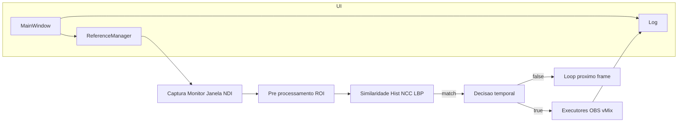

# SwitchPilot

Automação de corte de cenas para lives (OBS/vMix), com captura de tela/janela, comparação de imagem rápida (Hist+NCC+LBP) e execução de ações. Interface PyQt5 com tema escuro, título custom e suporte a DPI alto.

> **v1.5.1** - Agora com algoritmo de detecção otimizado! +5% de precisão no NCC, +1% no score final.

## 🚀 **Download**

[](https://github.com/Fabianob19/SwitchPilot/releases/latest)

**🎯 Recomendado**: [Instalador Windows](https://github.com/Fabianob19/SwitchPilot/releases/latest) (`SwitchPilot_v1.5.1_Setup.exe` - 65MB)  
**📁 Alternativa**: [Executável Direto](https://github.com/Fabianob19/SwitchPilot/releases/latest) (`SwitchPilot.exe` - 95MB)

## ✨ **Novidades v1.5.1**

### 🎯 **Instalador Profissional**
- **Instalador Windows**: Interface em Português com instalação automática
- **Ícones Corrigidos**: Atalhos no Menu Iniciar e Área de Trabalho funcionando
- **Desinstalação Fácil**: Registrado em "Programas e Recursos"
- **Tamanho Otimizado**: 65MB vs 95MB do executável direto

### ⚡ **Melhorias de Detecção**
- **NCC Otimizado**: +5% de precisão (77% → 82%)
- **Score Final**: +1% (94.3% → 95.3%)
- **Downscaling Inteligente**: Processamento mais robusto com 128x128 pixels
- **Ensemble Rebalanceado**: Histograma (40%), NCC (20%), LBP (40%)

## Visão Geral
- **Fontes**: Monitor, Janela (NDI opcional)
- **Detecção**: Ensemble Histogram Correlation + NCC + LBP otimizado, com suavização temporal
  - **Precisão de detecção**: ~95% (score final)
  - **Performance**: ~0.54s por ciclo de detecção
  - **Otimização NCC**: Downscaling inteligente para 128x128 pixels
- **Ações**: OBS (WebSocket 5.x), vMix (API HTTP)
- **UI**: Título custom escuro, menubar integrada, seleção de ROI com prévia nítida
- **Windows**: AppUserModelID, ícone próprio, DPI-aware (Per-Monitor v2)

## Quickstart (Usuário Final)

### 🎯 **Instalação Recomendada (Instalador)**
1. Baixe `SwitchPilot_v1.5.1_Setup.exe` da [página de releases](https://github.com/Fabianob19/SwitchPilot/releases)
2. Execute o instalador e siga as instruções
3. O SwitchPilot será instalado em `C:\Program Files\SwitchPilot\`
4. Atalhos serão criados no Menu Iniciar e Área de Trabalho
5. Execute o SwitchPilot pelo Menu Iniciar ou atalho

### 📁 **Instalação Alternativa (Executável Direto)**
1. Baixe `SwitchPilot.exe` da [página de releases](https://github.com/Fabianob19/SwitchPilot/releases)
2. Extraia em uma pasta
3. Execute `SwitchPilot.exe`

### ⚙️ **Configuração Inicial**
1. Configure OBS/vMix (se usar) nas abas correspondentes
2. Em **Gerenciador de Referências**: escolha a fonte (Monitor/Janela) e clique em "Selecionar Região PGM"
3. Adicione imagens de referência e associe ações
4. Inicie o monitoramento

### 📋 **Requisitos**
- **Sistema**: Windows 10/11 (64-bit)
- **Memória**: 4GB mínimo, 8GB recomendado
- **Espaço**: 200MB livres
- **OBS**: WebSocket 5.x ativado
- **vMix**: API HTTP ativa
- **NDI**: Opcional

## Desenvolvimento
- Python 3.10+ (recomendado 3.11+)
- Ambiente virtual recomendado

Instalação (dev):
```
python -m venv .venv310
.venv310\Scripts\activate
pip install -r requirements.txt
python main.py
```

## Arquitetura
- Núcleo: `switchpilot/core/` (MainController, MonitorThread)
- Integrações: `switchpilot/integrations/` (OBS, vMix, NDI opcional)
- UI: `switchpilot/ui/` (MainWindow, widgets, temas)

Diagrama (alto nível):


Detalhes adicionais em `docs/arquitetura.md`.

## Licença
MIT. Veja `LICENSE`.

## Contribuindo
Veja `CONTRIBUTING.md` e `CODE_OF_CONDUCT.md`.

## Segurança
Reporte vulnerabilidades conforme `SECURITY.md`. 